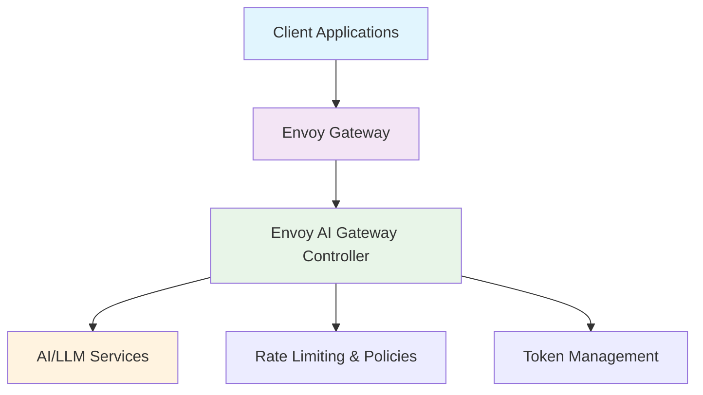

# Envoy AI Gateway Demos Repository

[](https://github.com/envoyproxy/ai-gateway/releases)
[](https://envoyproxy.slack.com/archives/C07Q4N24VAA)
[](https://aigateway.envoyproxy.io/docs/)

**Comprehensive demos and examples for the [Envoy AI Gateway](https://aigateway.envoyproxy.io/)**

Showcasing how to deploy, configure, and use AI Gateway features in Kubernetes environments

</div>

## ✨ Key Features of Envoy AI Gateway

- **🔌 Multi-Provider Support** - Route traffic to OpenAI, AWS Bedrock, Azure OpenAI, and more
- **🔒 Token-Based Rate Limiting** - Advanced rate limiting based on AI tokens, not just requests
- **🔄 Provider Fallback** - Automatic failover between AI providers for reliability
- **📊 OpenAI-Compatible API** - Drop-in replacement for OpenAI API clients
- **🛡️ Built on Envoy** - Leverages battle-tested Envoy Proxy technology
- **📈 Observability** - Rich metrics, tracing, and logging for AI workloads
- **🔧 Kubernetes Native** - Designed for cloud-native environments

## 🎯 What's Inside

- **Complete Demo Environments**: Ready-to-run demos with automated setup and testing
- **Infrastructure Automation**: Taskfile-based automation for cluster setup and management
- **CI/CD Integration**: GitHub Actions workflows for automated testing and validation
- **Production-Ready Examples**: Real-world configurations and best practices

## 📁 Repository Structure

```
├── demos/                    # Individual demo environments
│   └── 01-getting-started/   # Basic Envoy AI Gateway setup with LLM-D simulator
├── scripts/                  # Automation scripts for setup and management
├── .github/workflows/        # CI/CD workflows for automated testing
└── Taskfile.yml             # Main automation tasks
```

## 🚀 Available Demos

> 💡 **Each demo includes its own comprehensive README with detailed setup instructions, configuration options, and usage examples. Always refer to the individual demo README for complete guidance.**

### [01-getting-started](./demos/01-getting-started/)
A comprehensive introduction to Envoy AI Gateway featuring:
- **LLM-D Inference Simulator** as a lightweight AI backend
- **Qwen3 model** configured in echo mode for testing
- **Complete API endpoints** (chat, models, streaming)
- **Automated testing suite** with GitHub Actions integration
- **Performance tuning** (10ms TTFT, 20ms inter-token latency)

📖 **[Read the full demo README](./demos/01-getting-started/README.md)** for step-by-step instructions and detailed configuration.

## 🛠️ Prerequisites

Before running any demos, ensure you have:

- **Taskfile** - Task runner for automation [Installation](https://taskfile.dev/installation/) 

  ```bash
  sh -c "$(curl --location https://taskfile.dev/install.sh)" -- -d -b /usr/local/bin/
  ```
  
- **kind** - Kubernetes in Docker (installed automatically)
- **kubectl** - Kubernetes CLI (installed automatically)
- **helm** - Kubernetes package manager (installed automatically)
- **jq** - JSON processor (recommended for testing)
- **Docker** - Container runtime

## ⚡ Quick Start

### Option 1: Full Environment Setup
Set up the complete Envoy AI Gateway environment:

```bash
task setup-all
```

This will:
1. Install all required dependencies (kind, helm, kubectl)
2. Create a kind cluster with proper configuration
3. Install Envoy Gateway (latest version)
4. Install Envoy AI Gateway (latest version)
5. Configure AI Gateway integration
6. Verify the complete installation

### Option 2: Run a Specific Demo
Jump directly into a demo:

```bash
cd demos/01-getting-started
# Read the demo README first for detailed instructions
cat README.md
task setup
```

> 📝 **Important**: Each demo has its own README with specific setup instructions, configuration details, and usage examples. Always check the demo's README before running tasks.

## 📋 Available Tasks

View all available tasks:
```bash
task --list
```

## 🔧 Configuration

The following environment variables can be customized in `Taskfile.yml`:

- `CLUSTER_NAME` (default: `envoy-ai-gateway-demo`)
- `KIND_VERSION` (default: `v0.29.0`)
- `ENVOY_GATEWAY_VERSION` (default: `v0.0.0-latest`)
- `ENVOY_AI_GATEWAY_VERSION` (default: `v0.0.0-latest`)


### 🏗️ Core Setup Tasks

- `task setup-all` - Complete environment setup from scratch
- `task create-cluster` - Create kind cluster with Envoy Gateway
- `task install-envoy-gateway` - Install Envoy Gateway only
- `task install-envoy-ai-gateway` - Install Envoy AI Gateway only
- `task verify-installation` - Verify all components are running

### 🔍 Monitoring & Status Tasks

- `task port-forward` - Port forward to access gateway (localhost:8080)
- `task status` - Check status of all components
- `task logs` - View logs from AI Gateway components

### 🧹 Cleanup Tasks

- `task cleanup` - Remove all resources and cluster
- `task reset` - Reset environment for fresh start

### Utility Tasks

- `task cleanup` - Remove k3s cluster and cleanup
- `task logs-envoy-gateway` - View Envoy Gateway logs
- `task logs-ai-gateway` - View AI Gateway logs
- `task port-forward` - Port forward to access gateway (localhost:8080)
- `task verify-installation` - Verify installation status


## 🐛 Troubleshooting

### Common Issues

1. **Kind cluster creation fails**
   ```bash
   # Ensure Docker is running and has sufficient resources
   docker info
   task cleanup && task create-cluster
   ```

2. **Gateway installation fails**
   ```bash
   # Verify cluster readiness
   kubectl get nodes
   kubectl get pods -A
   task verify-installation
   ```

3. **Port forwarding issues**
   ```bash
   # Kill existing port forwards and restart
   pkill -f "kubectl.*port-forward"
   task port-forward
   ```

4. **Demo-specific issues**
   ```bash
   # Check demo logs and status
   cd demos/01-getting-started
   task logs
   task test
   ```

### Getting Help

- **Task Status**: `task --status <task-name>`
- **Component Logs**: `kubectl logs -n envoy-gateway-system -l app=envoy-gateway`
- **Installation Check**: `task verify-installation`
- **Demo Diagnostics**: Each demo includes comprehensive logging and testing

## 🚀 Development & Contributing

### Adding New Demos

1. Create directory: `demos/<demo-name>/`
2. Include required files:
   - `README.md` - Comprehensive demo documentation
   - `Taskfile.yml` - Demo-specific automation tasks
   - Kubernetes manifests and configurations
3. Add GitHub Actions workflow: `.github/workflows/demo-<name>.yml`
4. Test thoroughly with `task test`

### Best Practices

- **Documentation**: Each demo should be self-contained with clear README
- **Automation**: Use Taskfile for all setup, testing, and cleanup operations
- **Testing**: Include comprehensive test suites with error diagnostics
- **CI/CD**: Add GitHub Actions workflows for automated validation
- **Resource Management**: Ensure proper cleanup and resource limits

### Contributing Guidelines

1. Fork the repository
2. Create a feature branch: `git checkout -b feature/new-demo`
3. Develop your demo following the established patterns
4. Test locally: `task setup-all && cd demos/<your-demo> && task test`
5. Ensure CI passes: Check GitHub Actions workflows
6. Submit a pull request with detailed description

## 📚 Resources & Documentation

- **[Envoy AI Gateway](https://aigateway.envoyproxy.io/)** - Official documentation and guides
- **[Envoy Gateway](https://gateway.envoyproxy.io/)** - Core Envoy Gateway project
- **[Taskfile](https://taskfile.dev/)** - Task runner documentation
- **[Kind](https://kind.sigs.k8s.io/)** - Kubernetes in Docker
- **[LLM-D Inference Simulator](https://github.com/llm-d/llm-d-inference-sim)** - Lightweight AI backend for testing

<div align="center">


**Ready to get started?** 

Jump into the [**01-getting-started demo**](./demos/01-getting-started/) or run `task setup-all` to set up the complete environment! 🎉

</div>

## 🏗️ Architecture Overview



## 🔗 Official Documentation & Resources

### 📖 Documentation
- **[Envoy AI Gateway Docs](https://aigateway.envoyproxy.io/docs/)** - Complete documentation and guides
- **[Getting Started Guide](https://aigateway.envoyproxy.io/docs/getting-started/)** - Quick start tutorial
- **[Basic Usage](https://aigateway.envoyproxy.io/docs/getting-started/basic-usage/)** - Core concepts and examples
- **[LLM Provider Integrations](https://aigateway.envoyproxy.io/docs/latest/capabilities/llm-integrations/supported-providers)** - Supported AI services
- **[Release Notes](https://aigateway.envoyproxy.io/release-notes/)** - Latest updates and features

### 🌐 Community & Support
- **[GitHub Repository](https://github.com/envoyproxy/ai-gateway)** - Source code and issues
- **[Slack Community](https://envoyproxy.slack.com/archives/C07Q4N24VAA)** - Join the conversation
- **[Weekly Community Meetings](https://docs.google.com/document/d/10e1sfsF-3G3Du5nBHGmLjXw5GVMqqCvFDqp_O65B0_w/edit?tab=t.0)** - Thursdays
- **[GitHub Discussions](https://github.com/envoyproxy/ai-gateway/issues?q=is%3Aissue+label%3Adiscussion)** - Community Q&A

### 🔧 Related Projects
- **[Envoy Gateway](https://gateway.envoyproxy.io/)** - Core gateway functionality
- **[Envoy Proxy](https://envoyproxy.io/)** - The underlying proxy technology
- **[LLM-D Inference Simulator](https://github.com/llm-d/llm-d-inference-sim)** - Lightweight testing backend
